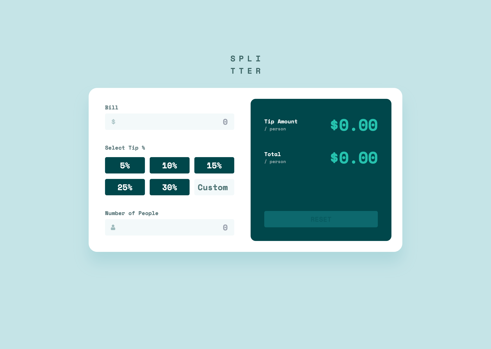
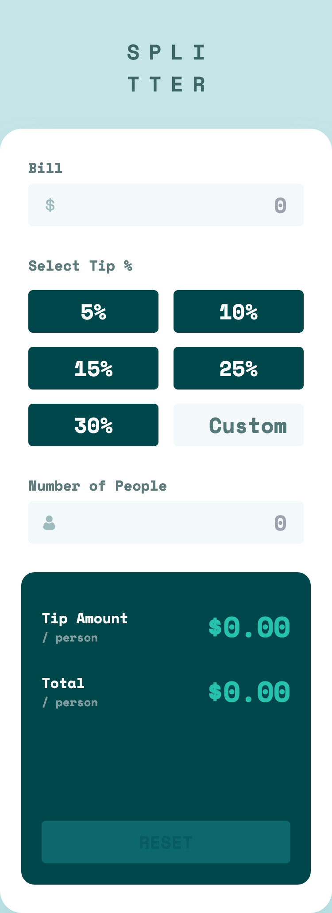

# Frontend Mentor - Tip calculator app solution

This is a solution to the [Tip calculator app challenge on Frontend Mentor](https://www.frontendmentor.io/challenges/tip-calculator-app-ugJNGbJUX). Frontend Mentor challenges help you improve your coding skills by building realistic projects.

## Table of contents

- [Overview](#overview)
  - [The challenge](#the-challenge)
  - [Screenshot](#screenshot)
  - [Links](#links)
- [Getting Started](#getting-started)
  - [Prerequisites](#prerequisites)
  - [Installation](#installation)
- [My process](#my-process)
  - [Built with](#built-with)
  - [What I learned](#what-i-learned)
  - [Continued development](#continued-development)
  - [Useful resources](#useful-resources)
- [Author](#author)

## Overview

### The challenge

Users should be able to:

- Calculate the correct tip and total cost of the bill per person
- View the optimal layout for the app depending on their device's screen size
- See hover states for all interactive elements on the page

### Screenshot

<div style='display: flex; gap: 20px;'>


</div>

### Links

- Solution URL: https://www.frontendmentor.io/solutions/tip-calculator-app-with-nextjs-tailwind-storybook-vitest-OADw5NIyiY
- Live Site URL: https://tip-calculator-app-zeta-rust.vercel.app

## Getting Started

To get a local copy up and running follow these simple steps:

### Prerequisites

Make sure you have the following software installed on your machine:

- [Node.js](https://nodejs.org/) (Node.js 18.17 or later)
- [pnpm](https://pnpm.io/)

### Installation

1. Clone the repository:

   ```sh
   git clone https://github.com/jaceleedev/tip-calculator-app.git
   ```

2. Navigate to the project directory:

   ```sh
   cd tip-calculator-app
   ```

3. Install dependencies using pnpm:

   ```sh
   pnpm install
   ```

4. Start the development server:

   ```sh
   pnpm dev
   ```

5. Open your browser and visit http://localhost:3000 to view the project.

6. To start Storybook, run the following command and access it at http://localhost:6006

   ```sh
   pnpm run storybook
   ```

7. To run tests, use the following command:

   ```sh
   pnpm run test
   ```

## My process

### Built with

- Next.js (v14.2.5)
- React.js (v18)
- TypeScript (v5)
- Tailwind CSS (v3.4.1)
- Storybook (v8.2.9)
- Vitest (v2.0.5)
- Semantic HTML5 markup
- CSS Grid, Flexbox
- SEO & web accessibility

### What I learned

1. Starting with this project, I began practicing creating logic using state management in earnest. The tip calculator app may seem simple at first glance, and indeed, the logic for calculating tips isn't particularly complex. However, if we consider it as a service that actual users will interact with, we must handle various errors and exceptions that can pop up unexpectedly. This challenge makes the task more difficult than it initially appears. Due to this gap, although there weren't any particularly difficult aspects in the UI or the logic, I had the opportunity to solidify my understanding and skills.

### Continued development

1. When developing logic using state management, I try to avoid creating things impulsively. I'm aiming to follow the principle of keeping commonly used components as simple and "dumb" as possible, while developing the important logic in higher-level components. In this challenge, I put a lot of effort into structuring the code, developing the logic, and managing state, but I haven't yet found a definitive approach that works best for me. Continuous practice is the only way to improve.

### Useful resources

- [Next.js Documentation](https://nextjs.org/docs) - Comprehensive guide to Next.js features and API.
- [Tailwind CSS Documentation](https://tailwindcss.com/docs/installation) - Detailed documentation for Tailwind CSS.
- [Storybook Documentation](https://storybook.js.org/docs) - Official guide for building and testing UI components with Storybook.
- [Vitest Guide](https://vitest.dev/guide/) - Complete documentation for the Vitest testing framework.

## Author

- GitHub - [@jaceleedev](https://github.com/jaceleedev)
- Frontend Mentor - [@jaceleedev](https://www.frontendmentor.io/profile/jaceleedev)
